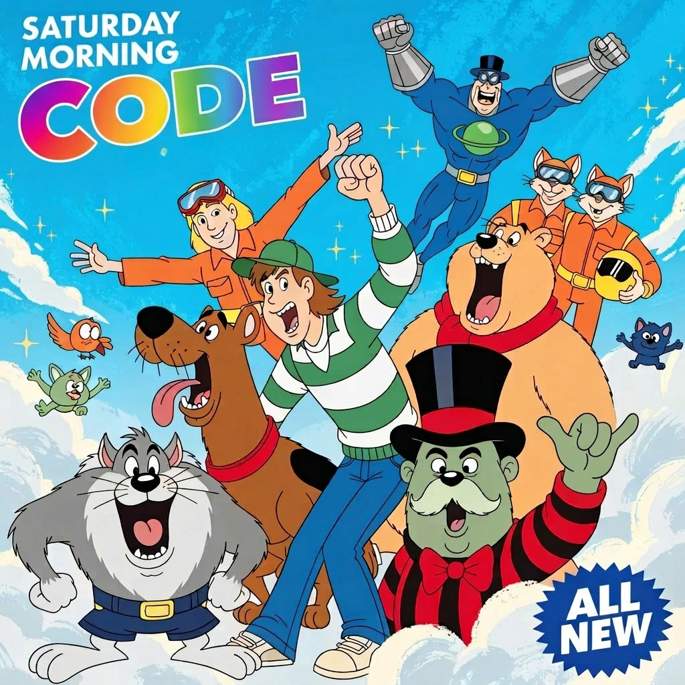

## What can you build with your first cup of coffee?

&#35;saturdaymorningcode is a personal challenge: one Saturday morning, one idea, one working thing, over here in the future that is 2026.
No roadmaps, just "go-that-a-way". Just an idea, a vibe to code, and however long until the vibes run thin. 
Less "shipping product," more "why has no one made this yet?".
These aren't polished, and they aren't meant to be, they are meant to be fun. They're the kind of code doodles that exist 
because the caffeine was kicking in and the tokens were flowing.

Join me - build stuff, set your GH topic to *saturdaymorningcode*, like [these](https://github.com/topics/saturdaymorningcode).
 * [Bare bones CMS](https://github.com/gravitymonkey/scm-site) - the source for [Stochastic Code Monkeys](https://www.stochasticcodemonkeys.com)
 * [YouTube Text Search](https://github.com/gravitymonkey/youtube-text-search/) - Extract transcripts to make a keyword + semantic RAG search across video
 * [Stochastic Code Monkeys](https://www.stochasticcodemonkeys.com/) - Blog; Ghost > Static Site
 * [AI Anxiety Radar Chart](https://github.com/gravitymonkey/radar_chart) - Make Your Own
 * [Ferric](https://github.com/gravitymonkey/ferric) - streaming music player
 * [We Will Reich You](https://github.com/gravitymonkey/we_will_reich_you) - If Queen performed "Clapping"
 * [Keenan's Resume Renamer](https://github.com/gravitymonkey/Keenan-hates-bad-resume-names)
 * [Paint-By-Number](https://github.com/gravitymonkey/paint_by_number) -- vibes ran thin on this one, but I made a t-shirt
 * [DAW Plugin for Atonal Music](https://github.com/gravitymonkey/stringtheory) -- worth coming back to this one
